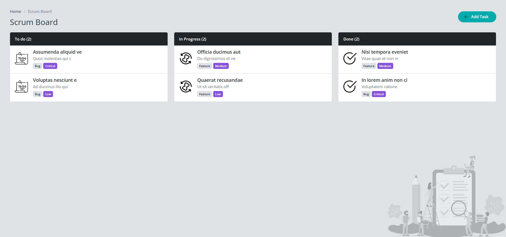
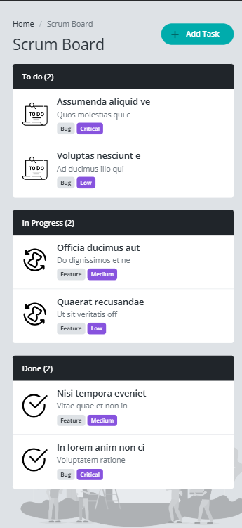

# YouCode Scrum Board Project - Task Management

## Description

The **YouCodeScrumBoard** is web-based project managment tool inspired by YouCode intranet platform. It provides a visual screen also create, read, update and delete tasks for keeping tracking your projects.

## Objective

The goals of this project are to:
- **Learn JavaScript**: Practice using JavaScript to interact with DOM (Document Object Model), including creating, editing and deleting elements dynamically (CRUD).
- **Use Bootstrap framework**: get a documentation about Bootstrap for save time on styling.
- **Local Storage**: to save the data when refrech or close the browser.
- **Data Validation**: validate data before submit it.

## Table of Contents

- [Usage](#usage)
- [Features](#features)
- [Installation](#installation)
- [Technologies Used](#technologies-used)

---

## Usage 

1. **Add Tasks**: Add tasks with specific descriptions to keep track of your work items.
2. **Show Taks**: Show the task informations when click it.
3. **Edit Task**: Edit a task informations or status
4. **Delete Task** : Delete a task.
5. **Local Storage**: save the data dynamically.

---

## Features

- **JavaScript DOM Manipulation**: Tasks are added, modified, and removed dynamically using JavaScript.
- **Bootstrap Design**: The layout and components use Bootstrap for a modern and responsive look.
- **Data Validation**: Task inputs are validated to ensure correct data entry, enhancing the user experience.
- **Drag and Drop**: use the mouse to switch between status

---


## Installation 

1. **Clone the reporsitory**:
    ```bash
      git clone https://github.com/AymanElh/YouCodeScrumBoard.git
    ```

2. **Navigate to the project directory**:
    ```bash
    cd YouCodeScrumBoard
    ```

3. **Open `index.html` in your browser** to start using the app locally.

--- 


## Technologies Used

- **HTML5**: Structure and layout of the application.
- **CSS3**: Styling and responsive design.
- **JavaScript (vanilla)**: Core functionality including DOM  manipulation, data validation, and drag-and-drop feature.
- **Bootstrap**: framework for using styling componenets.


## Preview 

### Desktop preview



